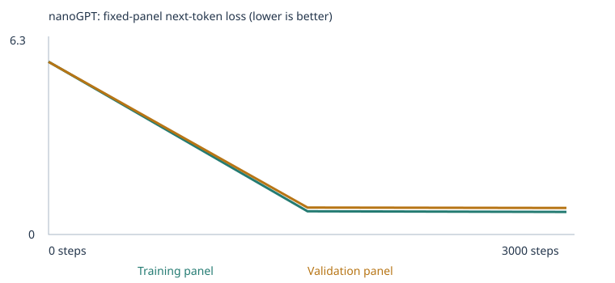

# My Custom LLM Experiment

Class 4 assignment. I trained a very small language model (Karpathy's nanoGPT, run through the class notebook) two times:

1. **Experiment 1:** the classroom sentences only.
2. **Experiment 2:** the classroom sentences plus my own teaching sentences for two eval categories, **negation** and **grammar**.

Both runs used the same settings and the same 48 eval cases. This model is tiny. It continues short sentences in the style of its training text. It is not a chat assistant and it does not understand language.

## Quick links

| | Experiment 1 (starter) | Experiment 2 (expanded) |
|---|---|---|
| Executed notebook | [custom_llm_starter.ipynb](experiment1_starter/custom_llm_starter.ipynb) | [experiment2_expanded.ipynb](experiment2_expanded/experiment2_expanded.ipynb) |
| All results | [results/](experiment1_starter/results/) | [results/](experiment2_expanded/results/) |
| Config | [config.json](experiment1_starter/results/config.json) | [config.json](experiment2_expanded/results/config.json) |
| Training summary | [training_summary.json](experiment1_starter/results/training_summary.json) | [training_summary.json](experiment2_expanded/results/training_summary.json) |
| Training log | [training.csv](experiment1_starter/results/training.csv) | [training.csv](experiment2_expanded/results/training.csv) |
| Eval results | [language_evals/](experiment1_starter/results/language_evals/) | [language_evals/](experiment2_expanded/results/language_evals/) |
| Chat transcript | [chat_transcript.json](experiment1_starter/results/chat_transcript.json) | [chat_transcript.json](experiment2_expanded/results/chat_transcript.json) |

The eval suite is unchanged: [evals/language_evals.json](evals/language_evals.json). The eval runner is [run_evals.py](run_evals.py) and the terminal chat is [chat.py](chat.py).

---

## 1. My choices and prediction

### Settings (same for both experiments)

| Setting | Value | Why |
|---|---|---|
| Corpus mode | `classroom` | Experiment 1 uses only the teacher's sentences as a baseline. Experiment 2 adds my files on top, so the only change between runs is the data. |
| Training steps | 3000 | The suggested starting budget. It ran in about a minute on a free Colab CPU. I first ran 10 steps to check that the notebook worked end to end (not used as evidence). |
| Learning rate | 0.001 | The suggested starting value. If the steps are too big, the numbers jump around and the loss can blow up. If they are too small, the model barely changes in 3000 steps. |

I kept everything else at the default (seed 42, 2 layers, 4 heads, 64 numbers per word, 48-token context, batch of 32).

### Prediction before Experiment 1

> Loss will drop and the final model will write short sentences that look like the teaching sentences, and eval scores will go up. But cases with unknown words (like "dog" in my test run) will still fail, because more training cannot add missing vocabulary.

### Prediction before Experiment 2

> Vocabulary coverage will rise from 24 to about 30 scorable cases, because is, are, not and the test words are now in the training text. I expect grammar to improve more than negation, since grammar only needs the nearby words, while negation needs the model to use a word from an earlier sentence.

### What happened

Both predictions held up. Loss dropped a lot, samples turned into real-looking sentences, and unknown-word cases stayed unscorable in Experiment 1. In Experiment 2, scorable cases went from 24 to exactly 30, grammar reached 3/3 and negation reached 2/3.

---

## 2. My corpus

### What the classroom corpus contains

I read the `classroom_corpus()` function in the notebook. It builds sentences by filling 9 fixed templates with words from 8 topics (store, market, bank, fruit/kitchen, transport/station, software/office, hospital, school). Examples:

- `the report about the {noun} explains the {context} in detail .`
- `our {place} has a question about the {adjective} {noun} and {context} .`

That gives only 133 word types. The corpus never uses `is`, `are` or `not`, and every line is a single sentence. That explains why all 24 extension eval cases were unscorable in Experiment 1.

### What I added in Experiment 2

| File | Unique passages | What it teaches |
|---|---|---|
| [corpus/negation_teaching.txt](corpus/negation_teaching.txt) | 2,624 | "X is not A. It is B. X is B." with colours, states, open/closed places, "did not buy A, bought B" food stories, and people at places |
| [corpus/grammar_teaching.txt](corpus/grammar_teaching.txt) | 2,661 | one/a + singular + is, two/many + plural + are/were, I am, and verb forms like walk / walks / walked / walking with time words (yesterday, every day, now) |

**Source and permission:** I wrote these myself with a small script, [corpus/make_teaching_corpus.py](corpus/make_teaching_corpus.py), which fills templates with word lists. No outside text was used. I used an AI assistant (Claude) to help write the script and plan the categories, and I reviewed the output.

**Why these two categories:**
- Both depend on `is` / `are`, which were completely missing. I found this in Experiment 1's chat, where the model marked `is` as an unknown word. So one set of new sentences helps both categories.
- Negation has the answer inside the prompt ("it is blue"), so the model only has to learn to pick the right earlier word.
- Grammar only needs the word or two right before the blank ("one bird ___", "the dogs ___").
- I expected spatial relations, reference and sequence to be harder for a 2-layer model, and opposites and everyday knowledge were hard to teach without writing the test pairs themselves.

**One thing I had to work around:** the notebook splits text into separate passages wherever a period is followed by a space. A normal story like `the cup is not green . it is yellow .` would become three unrelated passages, and the model would never see the "not ... it is" link. So inside each negation story I left out the space after the inner periods (`green .it is`). The tokens are exactly the same (`green`, `.`, `it`), but the whole story stays in one passage. Section 3 of the notebook confirmed this worked, for example `max did not choose eggs . he chose coffee . max chose coffee .` appears as one training document.

Files are TXT only, so there was no PDF extraction to check. [corpus_manifest.json](experiment2_expanded/results/corpus_manifest.json) shows no warnings and no ignored files.

### Keeping the evals out of training

- The script skips the exact test phrases `one bird`, `the dogs` and `yesterday she`.
- I also removed any sentence that was just a test story with one noun swapped (`is not red .it is blue`, `did not buy tea ... bought milk`, `is not open .it is closed`).
- The notebook's own leakage check found no eval prompts in my files. [eval_separation.json](experiment2_expanded/results/eval_separation.json) shows 160 classroom sentences removed for the 16 starter test prefixes, the same as in Experiment 1.
- The eval suite hash (`1d7c503f...`) is identical in both runs.
- One judgment call: a negation test uses the name `ava`. I put `ava` only in two neutral sentences (`ava is a student at the local school .`, `ava is not late today .`) so the word exists in the vocabulary. It never appears in a buying story.

These are still public development tests that guided my data choices, so the Experiment 2 score does not prove the model would work on new, unseen tests.

---

## 3. My runs

| | Experiment 1 | Experiment 2 |
|---|---|---|
| Completed steps | 3000 (not interrupted) | 3000 (not interrupted) |
| Time | 65 seconds | 90 seconds |
| Hardware | Google Colab, CPU | Google Colab, CPU |
| Parameters | 111,872 | 123,200 |
| Word types in training | 133 | 310 |
| Vocabulary size (with `<UNK>`, `<BOS>`, `<EOS>`) | 136 | 313 |
| Training / validation passages | 4,132 / 460 | 8,889 / 988 |
| Training / validation unknown-word rate | 0% / 0% | 0% / 0% |

Vocabulary reports: [Exp 1](experiment1_starter/results/vocabulary_report.json), [Exp 2](experiment2_expanded/results/vocabulary_report.json). Both runs are far below the 509-word limit, so every word was kept.

Experiment 2 has more parameters only because the vocabulary is bigger. Each word gets its own 64 numbers, and 177 extra words x 64 = 11,328, which is exactly the difference.

**About the split:** duplicates are removed, then passages are split 90/10. Validation passages never update the weights. But the validation sentences come from the same templates as the training sentences, so good validation loss only shows the model learned these templates. It does not show it can handle new kinds of sentences.

---

## 4. Loss

Loss measures how surprised the model is by the real next word. Lower means it guessed better. These numbers come from fixed panels of **20 training and 20 validation passages**, so they are small estimates, not the whole corpus.

**Experiment 1** ([history.json](experiment1_starter/results/history.json))

| Step | Training loss | Validation loss |
|---|---|---|
| 0 | 4.926 | 4.928 |
| 1500 | 0.682 | 0.718 |
| 3000 | 0.678 | 0.706 |


**Experiment 2** ([history.json](experiment2_expanded/results/history.json))

| Step | Training loss | Validation loss |
|---|---|---|
| 0 | 5.767 | 5.764 |
| 1500 | 0.775 | 0.898 |
| 3000 | 0.754 | 0.886 |



What I see:

- **The starting loss is what pure guessing gives.** If you pick evenly among 133 words, the loss is about ln(133) = 4.89. Experiment 1 started at 4.93. With 310 words, ln(310) = 5.74, and Experiment 2 started at 5.77.
- **Almost all learning happened in the first half.** From step 1500 to 3000 the loss only dropped by about 0.01 to 0.02. The templates are simple, so the model learned them early.
- **Validation stayed close to training.** No big sign of memorizing only the training passages.
- **Experiment 2 ended with a higher loss.** That does not mean it is worse. The two corpora are different, so the numbers can't be compared directly. My negation sentences are partly random on purpose. After `the cup is not`, any of 10 colours can come next, so no model could predict that word well. The gap between training and validation is also a bit larger (0.13 vs 0.03), which fits with validation containing colour or food pairs the model never saw together.

---

## 5. Samples: untrained, halfway, final

Same generation settings each time (temperature 0.8, same seed).

**Experiment 1** ([samples/](experiment1_starter/results/samples/))

| Step | Sample |
|---|---|
| 0 | `pear professor bond doctor course harvest team physician journey checking buyer delivery traffic report the lecturer item offering and system <UNK> taste ...` |
| 1500 | `our school has a question about the new educator and lesson .` / `a review of risk helped us understand the different deposit .` |
| 3000 | `the report about the nurse explains the health in detail .` / `the consumer compared the offering after checking the price .` |

**Experiment 2** ([samples/](experiment2_expanded/results/samples/))

| Step | Sample |
|---|---|
| 0 | `red i during drivers helping watch journey teachers client these closed security system patient park ...` |
| 1500 | `the plate is not black . it is purple . the plate is purple .` / `now ruby is walking to the school .` |
| 3000 | `the plate is not green . it is green . the plate is green .` / `now anna is walking to the school .` |

At step 0 the model just strings random words together, because every word is about equally likely. By step 1500 it writes full sentences that match the templates. Step 3000 looks almost the same as 1500, which matches the flat loss curve.

The Experiment 2 final sample `the plate is not green . it is green .` is a good failure to notice. The shape of the negation story is perfect, but it contradicts itself. The model learned the pattern of the words, but it did not learn that "not" rules a colour out.

---

## 6. How the model learns, using my actual numbers

All numbers below are from Experiment 1: [tokenization.json](experiment1_starter/results/tokenization.json) and [inspection.json](experiment1_starter/results/inspection.json).

### Corpus to tokens to IDs

The **corpus** is just the pile of training sentences. The notebook splits each sentence into **tokens**, which here are whole words and punctuation. Each token type gets a number, its **ID**, from a fixed list of 136 entries.

Example sentence from my run: `today the school focused on lesson and the local professor .`

It becomes these IDs: `1, 121, 118, 101, 42, 74, 61, 7, 118, 63, 88, 3, 2`

`1` is `<BOS>` (start), `118` is `the` (used twice), `3` is the period and `2` is `<EOS>` (end). For training, the model reads the IDs one by one and at each position tries to guess the next one.

### ID to vector (embedding)

The inspected word is **`customer`, ID 28.** The model does not work with the number 28 directly. It looks up row 28 in a table and gets a list of **64 numbers**. That list is the word's **embedding** (or vector). At the start these 64 numbers are random.

First five of the 64 numbers:

| | 1 | 2 | 3 | 4 | 5 |
|---|---|---|---|---|---|
| Before training | -0.0576 | -0.0048 | 0.0426 | 0.0193 | 0.0156 |
| After training | 0.0366 | -0.0182 | 0.1330 | 0.1060 | 0.0630 |

The numbers moved a lot and got bigger overall. The full lists are in inspection.json.

The more interesting part is what these numbers ended up meaning. I compared `customer` with every other word (cosine similarity, from [checkpoint.json](experiment1_starter/results/checkpoint.json)):

| | Closest words to `customer` |
|---|---|
| Before training | bus, educator, helped, bank, risk (all about 0.2, basically random) |
| After training | shopper, client, buyer, subscriber, consumer (all about 0.97 to 0.98) |

The same thing happened to `apple` (closest after training: peach, orange, banana, pear, mango) and `nurse` (dentist, therapist, doctor, physician, surgeon). Nobody told the model these words belong together. They ended up with similar numbers because they show up in the same spots in the same templates.

### Weights, loss and gradient

The embedding table is only one part of the network. The model has 111,872 adjustable numbers in total, called **weights** or parameters. Together they decide which next word gets a high probability.

After each guess, the model computes the **loss** (how wrong it was). Then backpropagation computes a **gradient** for every weight. The gradient says: if you nudge this number up, does the loss go up or down, and how strongly?

### One real weight update

The notebook saved the very first update to the first of customer's 64 numbers:

| Before | Gradient | Learning rate at step 1 | After |
|---|---|---|---|
| -0.0575919 | +0.000693 | 0.00001 | -0.0576019 |

The gradient is positive, which means making this number bigger would make the loss worse. So the optimizer moved it the other way, down by 0.00001. The learning rate here is 0.00001 instead of 0.001 because of warmup: the notebook starts with tiny steps and ramps up. The AdamW optimizer mostly uses the sign of the gradient on the first step, so the change is about the same size as the learning rate. One step changes almost nothing. 3000 steps of this, across all weights, is what turned the random vector into the one above.

### Next-word probabilities

For the prefix `the customer`, here is what the model thinks comes next:

| Next word | Before training | After training |
|---|---|---|
| reviewed | 0.7% | 17.8% |
| recommended | 0.6% | 17.1% |
| ordered | 0.6% | 16.9% |
| selected | 0.8% | 16.3% |
| compared | 0.6% | 16.0% |
| returned | 0.8% | 14.3% |
| the | 0.8% | 0.09% |

Before training, every word is close to 1 out of 136 (0.74%). After training, the six verbs from the shopping template (`the customer ordered the product after checking the price .`) share almost all the probability, and everything else is near zero. That is exactly the template the model saw.

### Attention: using earlier words

Each word's vector alone is not enough to guess the next word. The model also needs to know what came before. **Attention** lets each position look back at earlier positions and decide how much to use each one.

For `<BOS> the customer`, one saved attention row shows that when the model sits on `customer` and looks back, it puts about 49% of its attention on `<BOS>`, 42% on `the`, and 9% on `customer` itself. It can only look backward, never at future words. The context limit is 48 tokens, so anything older than that is cut off.

Attention is also why negation could work at all in Experiment 2. To answer `the box is not red . it is blue . the box is`, the model has to look back past `red` and pick up `blue`.

### From probabilities to generated words, and temperature

To write text, the model turns its scores into probabilities, then **randomly picks** one word based on those probabilities, adds it, and repeats until it picks `<EOS>` or hits 24 words.

**Temperature** changes how that pick works. Low temperature makes likely words even more likely (safer, more repetitive). High temperature spreads the chances out (more variety, more mistakes). It only changes how words are picked at the end. The weights stay exactly the same.

Same seed and starting point, three temperatures ([Exp 1](experiment1_starter/results/temperature_comparison.json), [Exp 2](experiment2_expanded/results/temperature_comparison.json)):

| Temperature | Experiment 1 | Experiment 2 |
|---|---|---|
| 0.3 | `a review of risk helped us understand the different investment .` | `the plate is not pink . it is gray . the plate is gray .` |
| 0.8 | `a review of risk helped us understand the different deposit .` | `the plate is not green . it is green . the plate is green .` |
| 1.2 | `a review of risk helped us understand the different deposit .` | `the plate is not green . it is green . the plate is green .` |

In Experiment 1 the three temperatures gave nearly identical sentences, because the model is very sure about its templates and small changes in probability don't change the pick. In Experiment 2, temperature 0.3 produced a correct negation story, while 0.8 and 1.2 produced the self-contradicting one. Picking with more randomness let a less likely colour slip in.

Seed also matters. In my Experiment 1 chat I sent `the dog ran to the park` three times and got three different replies, including one empty reply. The model did not change. Only the random pick did.

---

## 7. The 48 language evals

### How scoring works

Each case gives the model a prompt and four one-word choices. The runner only sends the prompt. The model scores 1 if the correct choice gets the highest probability of the four, and 0 otherwise. If any prompt word or choice is not in the vocabulary, the case is **unscorable** and counts as 0. The runner also saves a free continuation, which is the model's own text and is separate from the multiple-choice score. The runner never updates the weights.

- **All-case success** = correct / 48
- **Scorable accuracy** = correct / cases the model could be scored on
- **Coverage** = scorable / 48

### Four-row comparison

| Experiment | Stage | Correct / 48 | Scorable / 48 | Accuracy among scorable | Full results |
|---|---|---|---|---|---|
| Starter corpus | Untrained | 9 (18.8%) | 24 (50%) | 37.5% | [untrained](experiment1_starter/results/language_evals/untrained/) |
| Starter corpus | Trained | 20 (41.7%) | 24 (50%) | 83.3% | [final](experiment1_starter/results/language_evals/final/) |
| Expanded corpus | Untrained | 9 (18.8%) | 30 (62.5%) | 30.0% | [untrained](experiment2_expanded/results/language_evals/untrained/) |
| Expanded corpus | Trained | 26 (54.2%) | 30 (62.5%) | 86.7% | [final](experiment2_expanded/results/language_evals/final/) |

Summary comparisons: [Exp 1](experiment1_starter/results/language_eval_comparison.json), [Exp 2](experiment2_expanded/results/language_eval_comparison.json).

### By group

| Group | Exp 1 untrained | Exp 1 trained | Exp 2 untrained | Exp 2 trained |
|---|---|---|---|---|
| Starter patterns (16) | 6 | **16** | 6 | **16** |
| Starter transfer / new wording (8) | 3 | 4 | 2 | 5 |
| Extension challenges (24) | 0 (0 scorable) | 0 (0 scorable) | 1 (6 scorable) | **5** (6 scorable) |

### By extension category

| Category | Exp 1 trained | Exp 2 trained | Notes |
|---|---|---|---|
| grammar | 0/3, unscorable | **3/3** | added in Exp 2 |
| negation | 0/3, unscorable | **2/3** | added in Exp 2 |
| opposites | 0/3, unscorable | 0/3, unscorable | not added |
| reference | 0/3, unscorable | 0/3, unscorable | not added |
| sequence | 0/3, unscorable | 0/3, unscorable | not added |
| spatial relations | 0/3, unscorable | 0/3, unscorable | not added |
| everyday knowledge | 0/3, unscorable | 0/3, unscorable | not added |
| categories and analogies | 0/3, unscorable | 0/3, unscorable | not added |

### What changed, and why

**Experiment 1: learned patterns only.** Coverage stayed at 50% before and after training, so the jump from 9 to 20 correct came entirely from learning the templates. Starter patterns went to 16/16. With the same words in a new order, the model only got 4/8, so it depends heavily on the exact templates. All 24 extension cases were unscorable, and no amount of extra training could fix that.

**Experiment 2: both vocabulary and patterns.** My new data first fixed coverage: negation and grammar went from unscorable to scorable (24 to 30 cases). But the untrained Experiment 2 model still got only 1 of those 6 right, which is basically chance. The gain to 5/6 came from training on the new patterns. So vocabulary made these cases possible, and learned patterns made them correct.

Starter patterns stayed at 16/16, so adding new data did not break what the model already knew. New wording went from 4/8 to 5/8, but that is one case and could be random.

**Grammar details** ([eval_results.csv](experiment2_expanded/results/language_evals/final/eval_results.csv)):

| Prompt | Picked | Probability | Free continuation |
|---|---|---|---|
| `one bird` | is | 0.999 | `is in the kitchen .` |
| `the dogs` | are | 0.997 | `are in the office .` |
| `yesterday she` | walked | 0.104 | `walked to the station .` |

These exact phrases were never in my training text. The model got them from sentences like `one cat is`, `two dogs are` and `yesterday he walked`. `yesterday she` was right but with low confidence, maybe because `she` never came right after `yesterday` in my data.

### Failure I looked into: negation case lang_33

| Prompt | Correct | Picked | Probabilities | Free continuation |
|---|---|---|---|---|
| `the door is not open . it is closed . the door is` | closed | **open** | open 0.30, closed 0.018 | `here .` |

Every word was in the vocabulary, so the problem is with what the model learned. When I checked my own script, I found the cause. To avoid copying this test, I removed every sentence that said "not open, it is closed" but kept the opposite direction "not closed, it is open". So in my training data, **every open/closed story ended with "open"**, and "closed" was never the answer. The model seems to have learned a simple rule, "open/closed stories end in open", and it never had a reason to copy the word after "it is". The reply `here` probably comes from my `door is not missing .it is here .` sentences.

Compare with the two negation cases it got right:

| Case | In my training data | Result |
|---|---|---|
| box: not red, it is blue | 10 colours in every pairing, each colour was an answer many times | picked blue (0.96) |
| ava: did not buy tea, bought milk | 12 foods in random pairings, each food was an answer | picked milk (0.91) |
| door: not open, it is closed | only one direction, "closed" was never an answer | picked open |

I also removed the exact red/blue and tea/milk pairings, yet the model still got those right. So when the answer word rotates through many different stories, the model really does learn to use the earlier word. When there is only one fixed pairing, it memorizes the answer.

---

## 8. Chat interface

### How I ran it

I used section 10 of the notebook. You edit `CHAT_PROMPT` and run the cell again for each new message. It uses the model trained in that same run, starts fresh for every prompt (no memory), shows unknown words, and saves every turn to `chat_transcript.json`. Chatting does not train the model or add anything to the corpus.

### Launching it from this repo (terminal)

```sh
git clone https://github.com/olive1208/custom-llm
cd custom-llm
pip install -r requirements.txt
python chat.py --model experiment2_expanded/results/model.pt --transcript my-chat.json
```

Type a prompt, press Enter, and type `/quit` to stop. Use `experiment1_starter/results/model.pt` for the first model. `model.pt` contains both the weights and the vocabulary. (`checkpoint.json` is only for the embedding viewer and cannot run the model.) Remember it is a tiny model: it continues text, it does not answer questions, and it can only use the 48 most recent tokens.

### Experiment 1 chat (model hash `700c31cd...`, 3000 steps)

Screenshots: [chat1](experiment1_starter/chat1.png), [chat2](experiment1_starter/chat2.png), [chat3](experiment1_starter/chat3.png), [chat4](experiment1_starter/chat4.png). Full transcript: [chat_transcript.json](experiment1_starter/results/chat_transcript.json) (8 turns).

| Prompt | Reply | Unknown words |
|---|---|---|
| `our school has a question about` | `the different teacher and student .` | none |
| `the report is about` | `the explains the traffic in detail .` | is |
| `the dog ran to the park` | `the different subscriber focused on .` | dog, park, ran, to |
| `my mom` | `the important peach with another banana at the kitchen .` | my, mom |

The only fully known prompt gets a clean template sentence. Everything else shows the vocabulary limit. Even `is` is unknown to this model.

### Experiment 2 chat (model hash `9c9dfd0b...`, 3000 steps)

Screenshots: [chat1](experiment2_expanded/experiment2_chat1.png), [chat2](experiment2_expanded/experiment2_chat2.png), [chat3](experiment2_expanded/experiment2_chat3.png), [chat4](experiment2_expanded/experiment2_chat4.png). Full transcript: [chat_transcript.json](experiment2_expanded/results/chat_transcript.json) (5 turns).

| Prompt | Reply | Unknown words |
|---|---|---|
| `the cup is not white . it is black . the cup is` | `black .` | none |
| `yesterday tom` | `visited a friend .` | none |
| `our school has a question about` | `the important tutor and student .` | none |
| `the lamp is above the desk . the desk is` | `not white yellow . the driver is at the hospital .` | above, desk |

Notes:
- The cup reply is correct, and it uses exactly the same story shape as the lang_33 test it failed. Same pattern, different words, different result. This supports my explanation above: the problem is how open/closed was paired in my data.
- `yesterday tom visited a friend .` is an exact sentence from my training file, so this shows memorization more than understanding.
- **Limitation:** the lamp prompt is spatial relations, which I did not teach. `above` and `desk` are unknown, and the model falls back on my negation template (`not white yellow`) and then a sentence from another template. The new data changed the model's habits, and it now pushes negation-style text into places where it doesn't belong.

---

## 9. How to rerun the evals

From the repository root, after `pip install -r requirements.txt`:

```sh
# Experiment 1
python run_evals.py --model experiment1_starter/results/model.pt --output results/exp1-final-rerun
python run_evals.py --model experiment1_starter/results/model_untrained.pt --stage untrained --output results/exp1-untrained-rerun

# Experiment 2
python run_evals.py --model experiment2_expanded/results/model.pt --output results/exp2-final-rerun
python run_evals.py --model experiment2_expanded/results/model_untrained.pt --stage untrained --output results/exp2-untrained-rerun
```

Use a new output folder each time. A CPU is enough. The saved summaries include the suite and model hashes, so you can check the rerun used the same tests and weights.

I tested the Experiment 2 command above in a fresh Colab notebook after cloning this repo. The rerun gave exactly the same result as the notebook: 26/48 correct and 30 scorable (extension 5/24, starter patterns 16/16, starter transfer 5/8). Screenshot: [rerun_evals_test.png](experiment2_expanded/rerun_evals_test.png)

To rebuild my teaching files: `cd corpus && python make_teaching_corpus.py`.

---

## 10. Limitations and next experiment

**Limitations**

- The model only learns the exact templates it sees. It got 16/16 on familiar templates, but only 5/8 when the same words came in a new order.
- All 18 cases in the six categories I did not teach are still unscorable. Adding data only helps the categories you add data for.
- My teaching data is also template-based and repetitive. The good negation and grammar scores show the model learned my templates. They don't show real understanding of "not" or plural nouns. The self-contradicting sample `the plate is not green . it is green .` makes this clear.
- The evals are public and I used them to decide what to add, so these are development results, not an unseen test.
- Small evaluation panels (20 passages each) mean the loss numbers are rough.

**Next experiment**

Fix the open/closed imbalance: add stories in both directions using many different objects (for example `the gate is not open .it is closed .the gate is closed .` plus the reverse), while still leaving out door + open/closed. Keep everything else the same, train a fresh model, and check whether lang_33 changes from `open` to `closed`. If it does, that would support the idea that the model needs each answer word to appear as an answer in many different stories. This would be a third experiment and would not replace the Experiment 2 results above.
